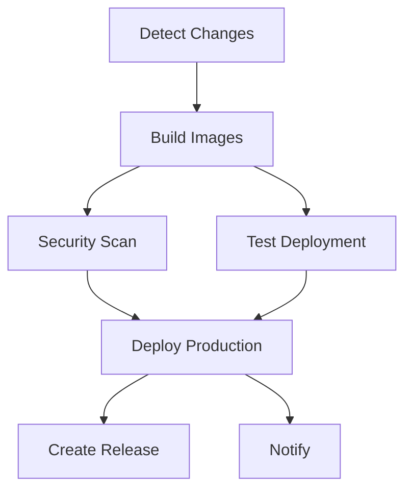
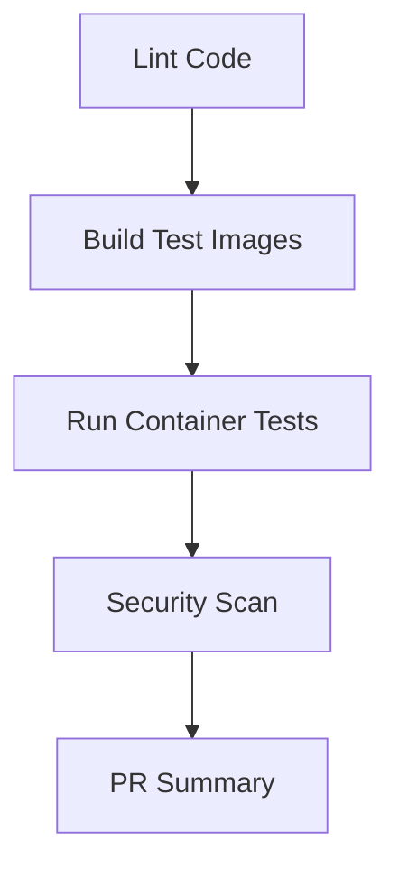
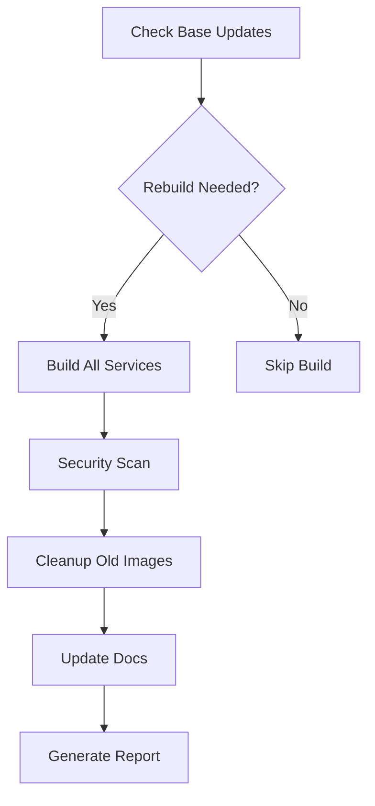

# 🚀 GitHub Actions CI/CD with Docker Build Cloud

Your AI development stack now includes a comprehensive CI/CD pipeline powered by GitHub Actions and Docker Build Cloud for automated building, testing, and deployment.

## 📋 Workflows Overview

### 1. 🚀 Main Build & Deploy (`build-and-deploy.yml`)
**Triggers:**
- Push to `main` or `develop` branches
- Pull requests to `main`
- Weekly schedule (Mondays at 2 AM)
- Manual dispatch

**Features:**
- ☁️ Docker Build Cloud integration
- 🔍 Smart change detection
- 🌍 Multi-platform builds (ARM64 + AMD64)
- 🔒 Security scanning with Trivy
- 📋 SBOM generation
- 🧪 Automated testing
- 🚀 Production deployment
- 📦 GitHub releases

### 2. 🔍 PR Check (`pr-check.yml`)
**Triggers:**
- Pull requests to `main` or `develop`

**Features:**
- 🧹 Code linting (Python, Docker, YAML)
- 🏗️ Fast single-platform builds
- 🧪 Container functionality tests
- 🔒 Security scanning
- 💬 Automated PR comments

### 3. 🌙 Nightly Build (`nightly-build.yml`)
**Triggers:**
- Daily at 2 AM UTC
- Manual dispatch with options

**Features:**
- 📅 Base image update detection
- 🔄 Fresh dependency installation
- 🧹 Automated cleanup
- 📊 Build reports
- 📝 Documentation updates

## ⚙️ Setup Requirements

### 1. GitHub Secrets
Add these secrets to your GitHub repository:

```bash
# Repository Settings → Secrets and Variables → Actions
DOCKER_HUB_TOKEN=your_docker_hub_access_token
```

### 2. Docker Build Cloud Setup
```bash
# Create cloud builder for GitHub Actions
docker buildx create \
  --driver cloud \
  bozzza/bruteforcegroup \
  --name cloud-builder

# Verify setup
docker buildx ls
```

### 3. Repository Settings

#### Branch Protection Rules
- **Branch:** `main`
- **Require status checks:** ✅
  - `lint`
  - `build-test`
  - `security-check`
- **Require branches to be up to date:** ✅
- **Restrict pushes:** ✅

#### Environments
Create a `production` environment:
- **Protection rules:** Required reviewers
- **Deployment branches:** `main` only

## 🔄 Workflow Details

### Build & Deploy Workflow



#### Change Detection
The workflow intelligently detects which services need rebuilding:

```yaml
# Auto-detect based on file changes
jupyter/**: Build Jupyter
api/**: Build API
config/mlflow/**: Build MLflow
config/streamlit/**: Build Streamlit
docker-compose*.yml: Build all
docker-bake.hcl: Build all
```

#### Build Matrix
Services are built in parallel for efficiency:

```yaml
strategy:
  matrix:
    service: [jupyter, api, mlflow, streamlit]
  fail-fast: false
```

### PR Check Workflow



#### Linting Steps
1. **Docker Compose validation**
2. **Docker Bake syntax check**
3. **Dockerfile linting** (Hadolint)
4. **Python code linting** (flake8, black, isort)

#### Container Testing
```bash
# Example Jupyter test
docker run --rm -d --name test-jupyter ai-jupyter:pr-123
sleep 15
docker ps | grep test-jupyter  # Verify running
docker stop test-jupyter
```

### Nightly Build Workflow



#### Update Detection
```bash
# Check for base image updates
jupyter_digest=$(docker manifest inspect jupyter/base-notebook:latest | jq -r '.digest')
python_digest=$(docker manifest inspect python:3.11-slim | jq -r '.digest')

# Rebuild conditions:
# 1. Force rebuild (manual trigger)
# 2. Monday (weekly rebuild)
# 3. Base image changes (planned feature)
```

## 🏷️ Image Tagging Strategy

### Production Images
```
bozzza/bruteforcegroup:ai-jupyter-latest
bozzza/bruteforcegroup:ai-jupyter-2025-06-18
bozzza/bruteforcegroup:ai-jupyter-v123
```

### Development Images
```
bozzza/bruteforcegroup:ai-jupyter-pr-45
bozzza/bruteforcegroup:ai-jupyter-nightly
bozzza/bruteforcegroup:ai-jupyter-develop
```

### Cache Images
```
bozzza/bruteforcegroup:cache
```

## 🔧 Manual Triggers

### Deploy Specific Services
```bash
# Via GitHub UI: Actions → Build and Deploy → Run workflow
# Select services: jupyter,api
# Environment: production
```

### Force Nightly Rebuild
```bash
# Via GitHub UI: Actions → Nightly Build → Run workflow
# Force rebuild: true
```

### Local Testing
```bash
# Test workflows locally with act
act -j build  # Test build job
act -j lint   # Test lint job
```

## 📊 Monitoring & Notifications

### Build Status
- ✅ **Success:** All checks passed
- ❌ **Failure:** Check logs for details
- ⏸️ **Skipped:** No changes detected

### Security Alerts
- 🔒 Trivy scan results in Security tab
- 📋 SBOM artifacts for compliance
- 💬 PR comments with scan summaries

### Build Artifacts
- 📄 Build reports
- 🔒 Security scan results
- 📋 SBOM files
- 📝 Documentation updates

## 🐛 Troubleshooting

### Common Issues

#### ❌ Build Cloud Connection Failed
```bash
Error: failed to solve: failed to create cloud builder
```
**Solution:**
1. Verify Docker Build Cloud setup
2. Check organization permissions
3. Recreate cloud builder

#### ❌ Docker Hub Authentication
```bash
Error: unauthorized: authentication required
```
**Solution:**
1. Check `DOCKER_HUB_TOKEN` secret
2. Verify token permissions
3. Re-generate access token

#### ❌ Security Scan Failed
```bash
Error: failed to scan image
```
**Solution:**
1. Check image exists in registry
2. Verify Trivy action version
3. Review scan configuration

### Debug Workflows

#### Enable Debug Logging
```yaml
env:
  ACTIONS_STEP_DEBUG: true
  ACTIONS_RUNNER_DEBUG: true
```

#### Check Build Logs
```bash
# View detailed build output
docker buildx bake --progress=plain
```

#### Manual Image Testing
```bash
# Pull and test image manually
docker pull bozzza/bruteforcegroup:ai-jupyter-latest
docker run --rm -p 8889:8888 bozzza/bruteforcegroup:ai-jupyter-latest
```

## 📈 Performance Optimization

### Build Speed
- ☁️ **Docker Build Cloud:** ~3x faster than standard runners
- 📦 **Layer Caching:** Shared across builds and team
- 🎯 **Smart Rebuilds:** Only changed services
- ⚡ **Parallel Builds:** Matrix strategy

### Resource Usage
- 🏗️ **Builder Sharing:** Multiple workflows use same cloud builder
- 💾 **Cache Optimization:** Registry cache with max mode
- 🧹 **Cleanup:** Automated removal of old images

### Cost Optimization
- 📅 **Scheduled Builds:** Weekly instead of daily
- 🎯 **Change Detection:** Skip unnecessary builds
- 🔄 **Cache Reuse:** Minimize redundant downloads

## 🎯 Best Practices

### 1. **Branch Strategy**
- `main`: Production releases
- `develop`: Integration testing
- `feature/*`: Development work

### 2. **Commit Messages**
Use conventional commits for automatic changelog:
```bash
feat(jupyter): add new AI library
fix(api): resolve memory leak
docs: update deployment guide
```

### 3. **Security First**
- 🔒 Regular vulnerability scans
- 📋 SBOM generation for compliance
- 🔐 Minimal base images
- 🛡️ Signed container images

### 4. **Testing Strategy**
- 🧪 Unit tests in containers
- 🔍 Integration testing
- 🚀 Smoke tests in production
- 📊 Performance benchmarks

## 📅 Maintenance Schedule

### Daily
- 🌙 Nightly builds (if base images updated)
- 🔒 Security scans
- 📊 Build reports

### Weekly
- 🔄 Force rebuild (Mondays)
- 🧹 Cache cleanup
- 📝 Documentation updates

### Monthly
- 🔍 Workflow review and optimization
- 📊 Performance analysis
- 🚀 Dependency updates

---

**🌩️ Powered by Docker Build Cloud | 🤖 Automated with GitHub Actions**

